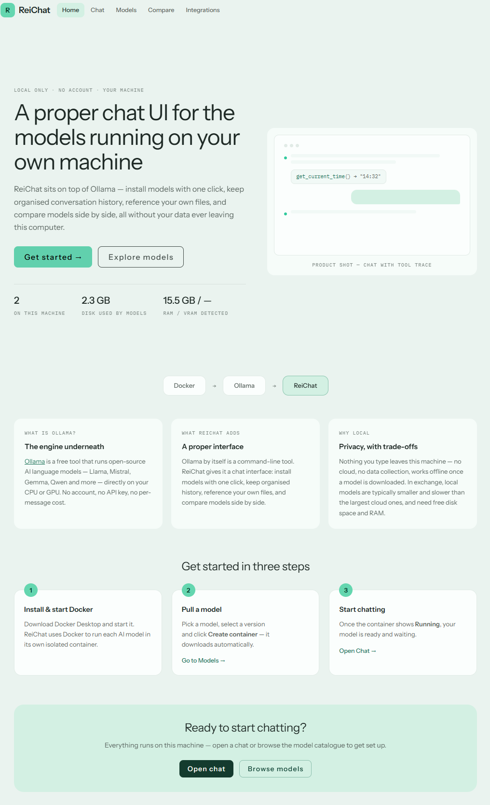
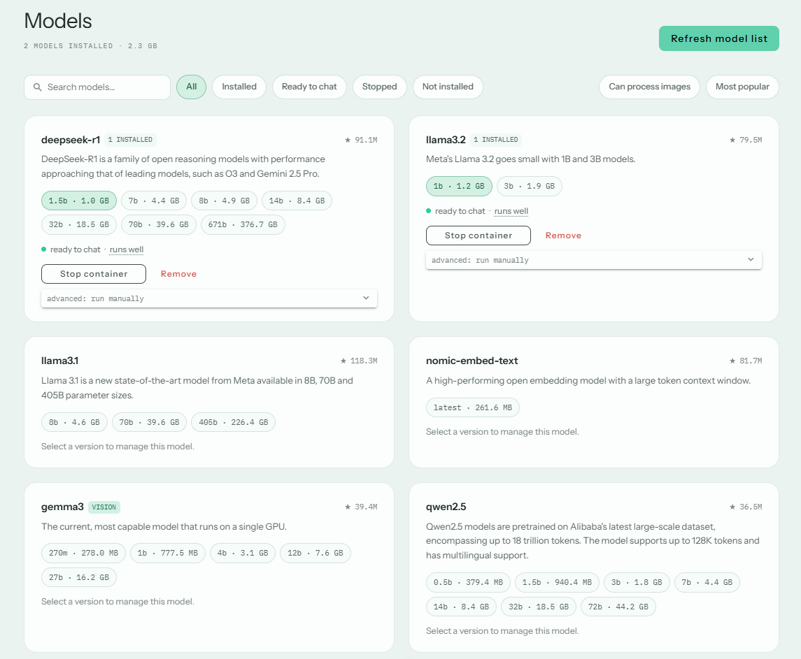
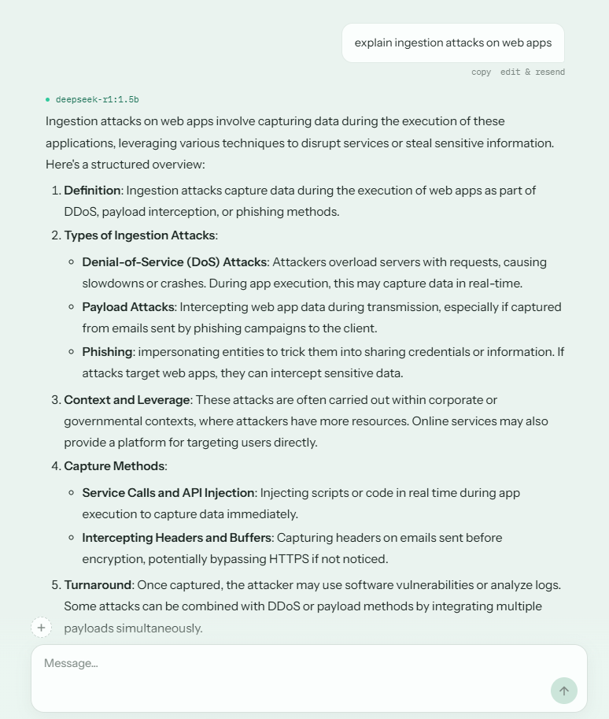

# ReiChat

**A friendly chat app for running AI models on your own computer — no account, no API key, no
subscription, and no data leaving your machine.**

Under the hood it runs [Ollama](https://ollama.com), the free tool that lets you download and run
open-source AI models like Llama, Mistral, Gemma and Qwen locally. ReiChat adds the parts Ollama
doesn't have on its own: a one-click model browser, real chat history, document Q&A, and more —
all in your browser.

---

## Screenshots







---

## What you can do here

- **Chat** with any model you install, with full conversation history, editable messages, and
  regenerate/branch support.
- **Compare models** — run the same prompt across several installed models side by side.
- **Chat with your documents** — upload a PDF, Markdown, text or Word file and ask questions about
  it.
- **Tool calling** — let a supporting model use built-in tools (calculator, current date/time), or
  connect your own via [MCP](https://modelcontextprotocol.io).
- **Prompt templates** — save reusable starter messages with fill-in-the-blank placeholders.
- **Vision models** — attach an image to your message for models that support it.

---

## Requirements

Just [Docker](https://www.docker.com/) (Docker Desktop bundles everything you need, including
Docker Compose).

---

## Quick start

### 1. Clone the repository

```bash
git clone https://github.com/JakubTuta/chatbot.git
cd chatbot
```

### 2. Start the app

```bash
docker-compose up -d
```

Open **http://localhost:3000** in your browser. Everything runs on `127.0.0.1` only — nothing here
is reachable from another device on your network.

---

## First run: install a model and chat

1. **Open the app.** The landing page shows a status banner if Docker or the backend isn't
   reachable yet, so you always know what's going on.
2. **Go to Models.** A starter catalog of popular models loads immediately. Press
   **Refresh model list** any time to pull the current list from ollama.com.
3. **Pick a model sized for your machine.** Each version shows its exact download size, and — once
   the app knows your hardware — whether it should run well, be tight, or not fit at all. Click
   **Create container** to download and start it. Progress streams live.
4. **Chat.** Once the model shows **Ready to chat**, head to the Chat page and start typing.
   Responses stream in as the model generates them.

Don't have a beefy machine? Small models like `llama3.2:1b` or `qwen2.5:0.5b` run comfortably on
almost anything and are a good way to try things out.

---

## GPU support (optional, makes models noticeably faster)

- **Windows** — [NVIDIA GPUs with WSL2](https://docs.docker.com/desktop/features/gpu/)
- **Linux / macOS** — [NVIDIA Container Toolkit](https://docs.nvidia.com/datacenter/cloud-native/container-toolkit/latest/install-guide.html#installation)

No GPU? Everything still works — models just generate more slowly on CPU.

---

## Troubleshooting

**"Docker is not running"** — Start Docker Desktop (or the Docker daemon) and click **Recheck** on
the banner; it also rechecks automatically.

**A model won't pull or install** — a bad or unpullable tag fails visibly with the real error
message instead of silently doing nothing. Check the message shown in the UI — it names the actual
problem (network, disk space, or an invalid tag).

**Refreshing the model list looks like it did nothing** — that's by design: refresh only adds and
updates models, it never deletes your chat history or removes an installed model from the list.

**Port already in use** — another process is bound to `3000`, `8000`, or `5432`. Stop it, or edit
the port mappings in `docker-compose.yaml`.

**Catalog refresh fails** (e.g. offline, or ollama.com unreachable) — your existing catalog is left
untouched and the app stays fully usable, just without ollama.com's current listings until you
retry.

---

## License

MIT — see [LICENSE](LICENSE) for details.
